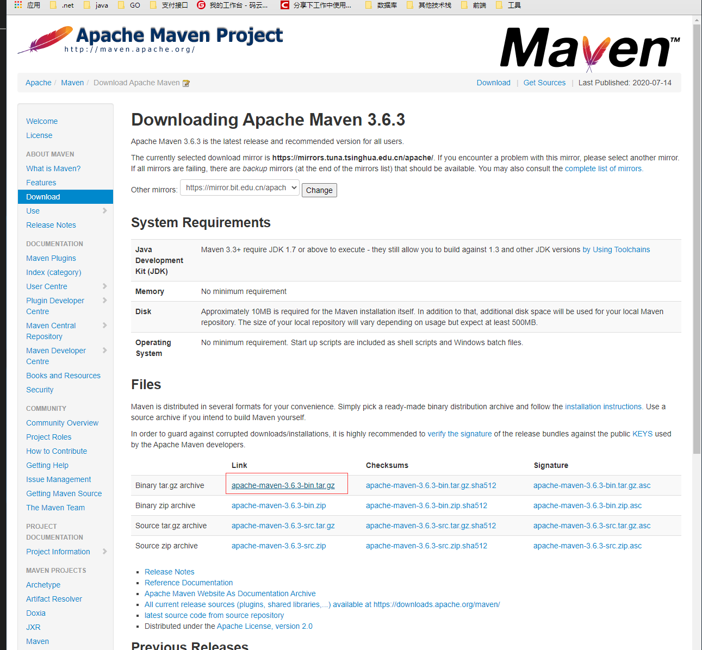
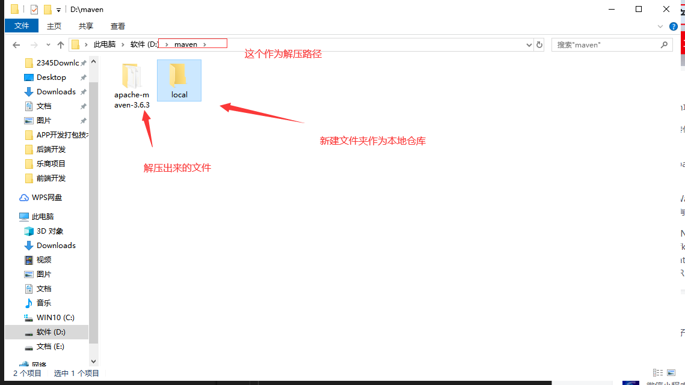
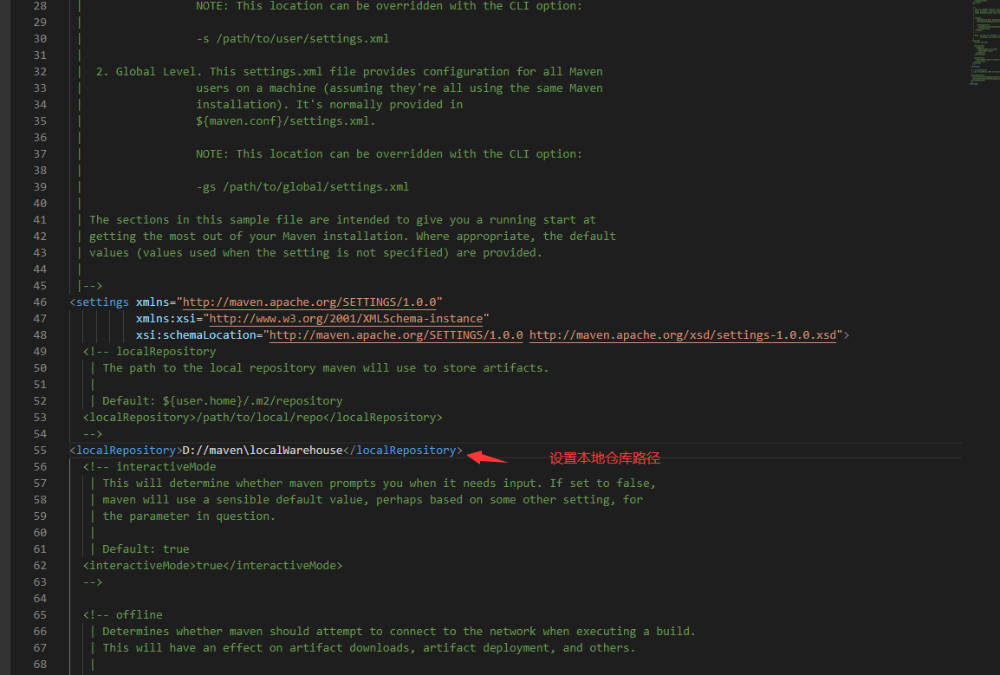
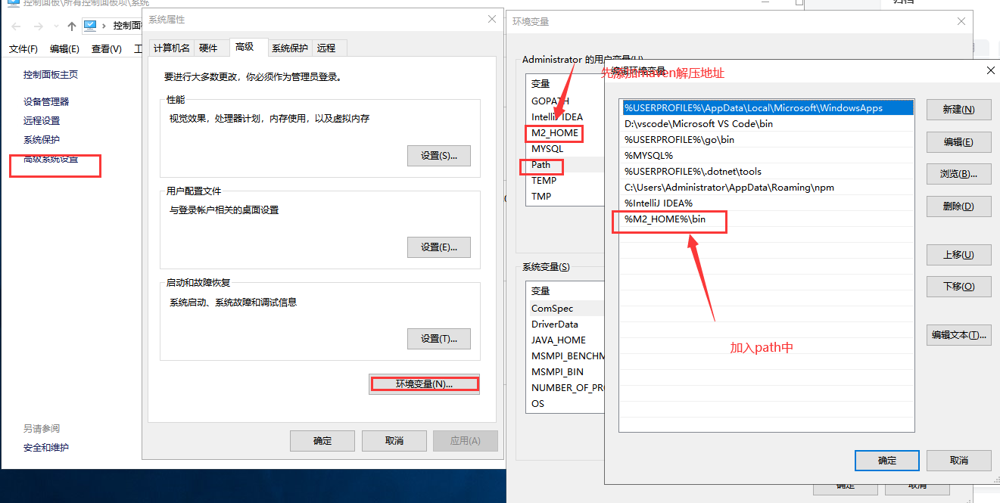
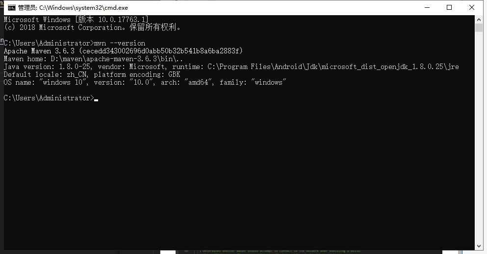
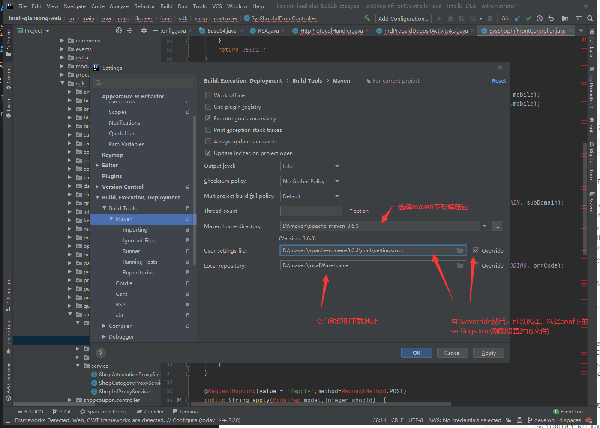
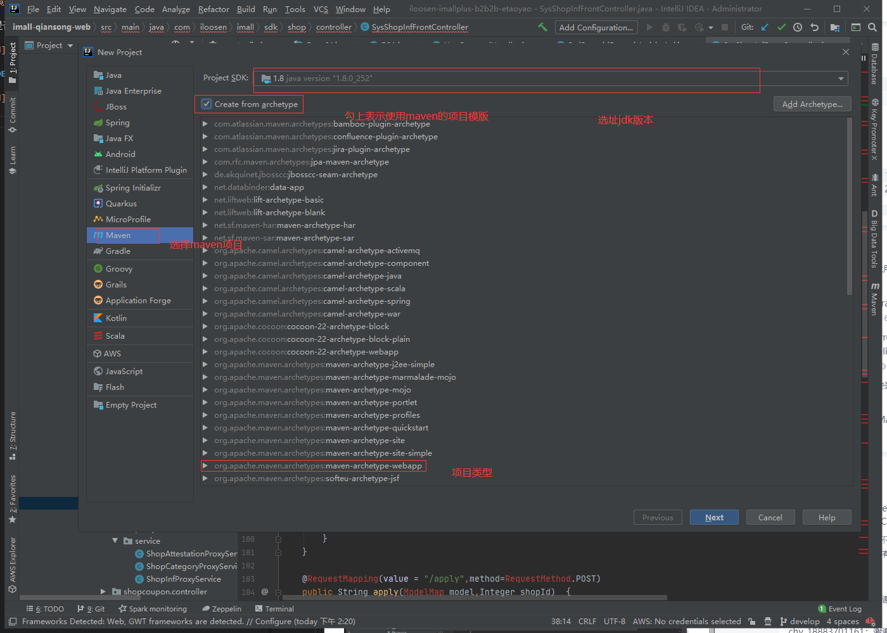
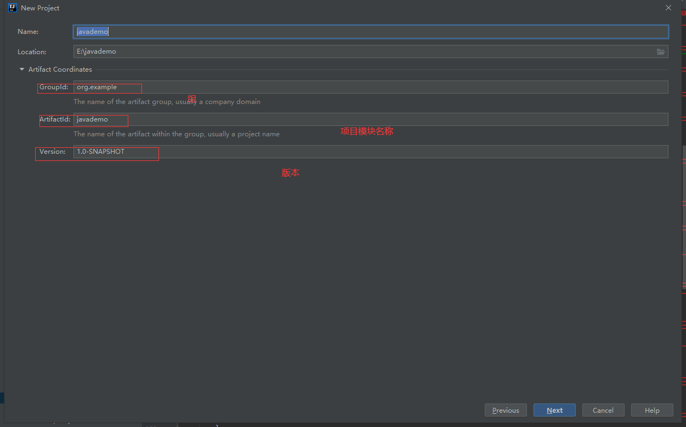
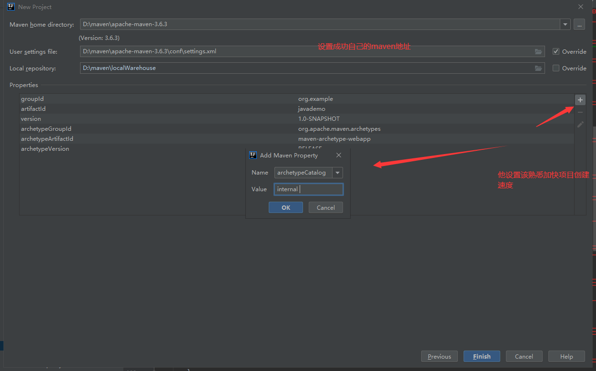
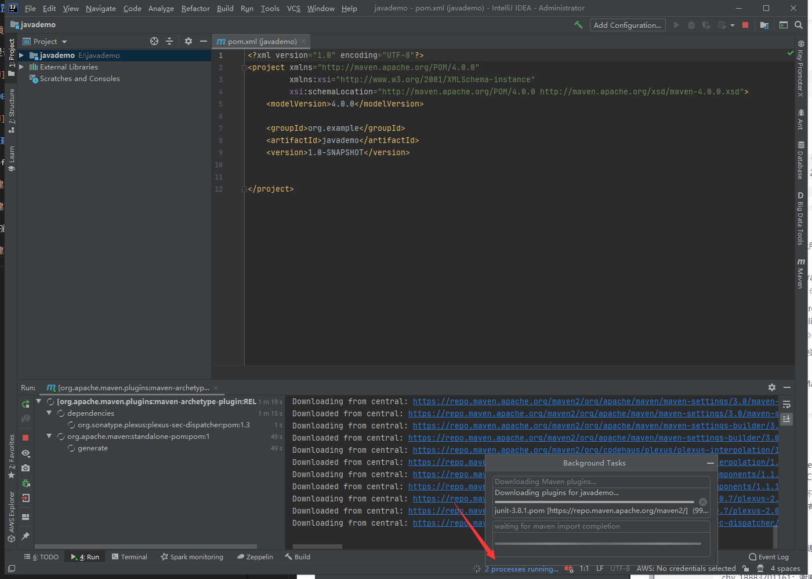

# idea配置maven

## 下载maven[官网地址](http://maven.apache.org/download.cgi)

## 创建本地仓库

## 修改配置文件设置本地仓库

`<localRepository>D://maven\localWarehouse</localRepository>`复制到settings.xml

## 设置maven环境变量

测试是否成功

## IDEA中配置maven

## 创建maven项目

idea>file>new-project

添加的配置为 archetypeCatalog=internal 加快速度

下载项目所需的jar包

